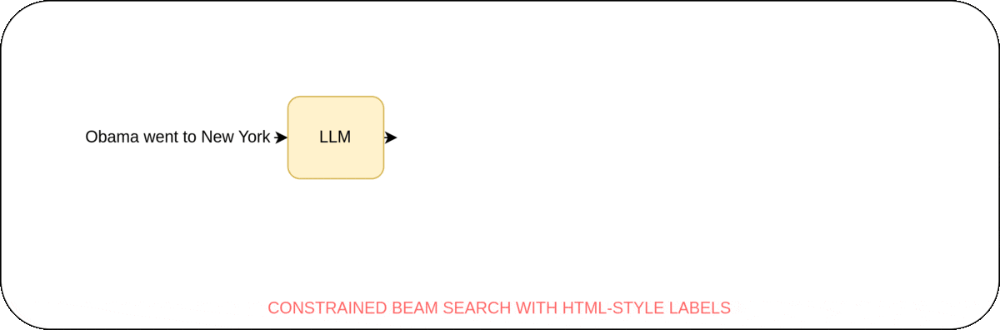
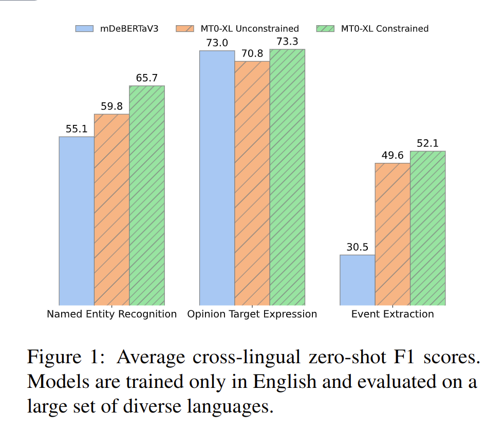
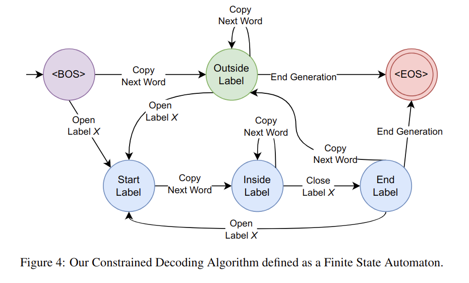

<p align="center">
    <br>
    
    <br>
<a href="https://twitter.com/intent/tweet?text=Wow:&url=https%3A%2F%2Fgithub.com%2Fikergarcia1996%2FSequence-Labeling-LLMs"></a>
<a href="https://github.com/ikergarcia1996/Sequence-Labeling-LLMs/blob/main/LICENSE.md"></a>
<a href="https://huggingface.co/docs/transformers/index"></a>
<a href="https://huggingface.co/docs/accelerate/index/"></a>
<a href="https://ikergarcia1996.github.io/Iker-Garcia-Ferrero/"></a>
<br>
<br>
</p>

This repository contains the code for performing Sequence Labelling 
 with Language Models (LLMs) as a Text2Text 
constrained generation task. The code is built on top of 
🤗HuggingFace's [Transformers](https://huggingface.co/docs/transformers/index) and
🤗HuggingFace's [Accelerate](https://huggingface.co/docs/accelerate/index) library.



We currently support:

- Encoder-Decoder Models such as BART, T5, FlanT5, etc.
- Decoder-only Models such GPT2, LLaMA, LLaMA-2, Vicuna, etc.
- Constrained Beam Search Decoding and Unconstrained Beam Search Decoding.
- Full model training and LoRA fine-tuning.
- Multi-Task training.
- 8 bits / 4 bits quantization of the model for training and inference.
- 8 bits optimizer.
- CPU offloading.
- Zero-shot / in-context learning inference using prompts.


## Table of Contents
- [Evaluation](#evaluation)  
- [Installation](#installation)  
- [Dataset Format](#dataset-format)  
- [Training a Model](#training-a-model)  
- [Training with Limited GPU memory (QLora and 8 / 4 bits quantification)](#training-with-limited-gpu-memory)  
- [Multi-Task Training](#multi-task-training)  
- [Zero-Shot / In-context learning Inference](#zero-shot-inference)  

## Evaluation

<p align="center">
    <br>
    
    <be>

## How does it work?
We implement our constrained decoding algorithm using a Finite State Automaton. At each state, the model can generate only a set of valid tokens. This set includes copying the next word from the input (if the word is split by the tokenizer into multiple tokens, all of them are copied to prevent splitting of words). It can also open an HTML tag, but only if no tag remains open, or close it, but only if we have already opened a tag and copied a word. The generation process ends when all the words in the input have been copied into the output and no label remains open.  

<p align="center">
    <br>
    
    <be>

## Installation

You need to install the following dependencies:

Required dependencies:
```bash
torch (See: https://pytorch.org/get-started/locally/)
transformers (pip install transformers)
accelerate (pip install accelerate)
wandb (pip install wandb)
```

Optional dependencies:
```bash
fairseq (pip install fairseq) # For Adafactor optimizer
PEFT (pip install peft) # For LoRA support
bitsandbytes (pip install bitsandbytes) # For 4 / 8 bits quantization and 8 bits optimizers
```

## Dataset Format
The dataset should be in IOB1/IOB2/BILOU format (conll format). Example:

```
EU	B-ORG
rejects	O
German	B-MISC
call	O
to	O
boycott	O
British	B-MISC
lamb	O
.	O

Peter	B-PER
Blackburn	I-PER

```

The output will include the finetuned model, the predictions on the evaluation and test sets, and the scores on the evaluation and test sets.

## Training a Model

Here is an example of how to train a FlanT5 model on the CoNLL-2003 dataset. See more examples
in the [examples](examples) folder. Run `python3 seq2seq.py --help` for more information.

```bash
accelerate launch seq2seq.py \
--mixed_precision bf16 \
--constrained_generation \
--train_tsvs examples/conll/en.conll.train.tsv \
--dev_tsvs examples/conll/en.conll.dev.tsv \
--test_tsvs examples/conll/en.conll.test.tsv \
--num_beams 4 \
--num_return_sequences 1 \
--model_name_or_path google/flan-t5-large \
--per_device_train_batch_size 16 \
--gradient_accumulation_steps 1 \
--per_device_eval_batch_size 8 \
--learning_rate 1e-4 \
--optim adafactor \
--lr_scheduler_type cosine \
--num_warmup_steps 500 \
--num_train_epochs 30 \
--eval_every_epochs 10 \
--max_source_length 256 \
--max_target_length 256 \
--output_dir results/conll/FlanT5large \
--project_name SeqLabeling_w_LLMs \
--add_labels_as_tokens
```
### Multi GPU
You can customize the number of GPUs using the `--num_processes` flags. 
See the [Accelerate Documentation](https://huggingface.co/docs/accelerate/index) for more information. You can also
configure accelerate using the `accelerate config` command (See [Accelerate Installation](https://huggingface.co/docs/accelerate/basic_tutorials/install))

```bash
  accelerate launch --num_machines 1 --num_processes 2 seq2seq.py 
  ```

Explanation of the arguments:
- mixed_precision: Enables mixed precision training. You can use `bf16` or `fp16`. If you hardware support it I recommend `bf16` precision in all cases. 
- constrained_generation: Enables constrained generation. 
- num_beams: Number of beams for constrained generation. More beams means better results but slower inference.
- num_return_sequences: Number of sequences to return (<= num_beams). We will evaluate the model taking into account only the most probable annotation, but you can output as many as you want, they will be saved in the `output_dataset.jsonl` file.
- train_tsvs, dev_tsvs, test_tsvs: Paths to the train, dev and test datasets. This argument allows you to use multiple datasets for training, validation and testing. Training datasets will be concatenated.
- optim: adafactor recommended for T5 based models, AdamW recommended for decoder models (GPT2, LLaMA, etc.)
- add_labels_as_tokens: Adds the labels (e.g. <Person>, </Person>) as tokens to the vocabulary. This usually helps to improve the performance a little bit. If you don't set this flag, you can define label verbalizations in `label_names.py`


## Training with Limited GPU memory
Training the full model requires a lot of GPU memory. [Low-Rank Adaptation (LoRA)](https://arxiv.org/abs/2106.09685) 
injects trainable rank decomposition matrices into each layer of the Transformer 
architecture, greatly reducing the number of trainable parameters for downstream tasks. For
even more memory reduction, we can quantize the model to 8 bits or 4 bits. You can also 
use an 8 bit optimizer for further memory reduction. See the [examples](examples) folder 
for examples of how to train different models with LoRA and 8 / 4 bits quantization.

If you still don't have enough memory, you can offload some of the model parameters to the CPU. For that set 
the `--force_auto_device_map` flag. This will split the model across all available GPUs and CPUs. This will be slower, but it will allow you to train the model or 
run inference with less memory.

Here
is the command for training a FlanT5 model with LoRA, 4 bits quantization and 8 bits optimizer:

```bash
accelerate launch seq2seq.py \
--mixed_precision bf16 \
--use_lora \
--quantization 4 \
--constrained_generation \
--train_tsvs examples/conll/en.conll.train.tsv \
--dev_tsvs examples/conll/en.conll.dev.tsv \
--test_tsvs examples/conll/en.conll.test.tsv \
--num_beams 4 \
--num_return_sequences 1 \
--model_name_or_path google/flan-t5-large \
--per_device_train_batch_size 32 \
--gradient_accumulation_steps 2 \
--per_device_eval_batch_size 8 \
--learning_rate 1e-4 \
--optim adamw8bits \
--lr_scheduler_type cosine \
--num_warmup_steps 500 \
--num_train_epochs 40 \
--eval_every_epochs 10 \
--max_source_length 256 \
--max_target_length 256 \
--output_dir results/conll/FlanT5large_QLoRA_8bits \
--project_name SeqLabeling_w_LLMs \
--add_labels_as_tokens
```

- Important Note: If you use LoRA with  `--add_labels_as_tokens` flag we will create a model with the extended vocabulary that will be saved in `output_dir/extended_model`.

## Multi-Task Training

You can train a model on multiple tasks by using multiple datasets. If the datasets have 
different labels, use the `--add_labels_as_prompt` flag. This will append the possible labels
for each sentence as a prompt. For example, for the CoNLL-2003 dataset, the prompt will be
`<Person> <Location> <Organization> <Misc> Obama went to New York`. This way, the model 
can be trained with multiple tasks/datasets simultaneously. Here is an example of how to
train a FlanT5 model in a mixture of Medical domain datasets:

```bash
  accelerate launch --mixed_precision bf16 seq2seq.py \
  --mixed_precision bf16 \
  --constrained_generation \
  --train_tsvs \
  medial-domain-datasets/en/en-e3c-train.tsv \
  medial-domain-datasets/es/es-e3c-train.tsv \
  medial-domain-datasets/fr/fr-e3c-train.tsv \
  medial-domain-datasets/it/it-e3c-train.tsv \
  medial-domain-datasets/en/en-diann-train.tsv \
  medial-domain-datasets/es/es-diann-train.tsv \
  medial-domain-datasets/en/en-neoplasm-train.tsv \
  medial-domain-datasets/es/es-neoplasm-train.tsv \
  medial-domain-datasets/fr/fr-neoplasm-train.tsv \
  medial-domain-datasets/it/it-neoplasm-train.tsv \
  medial-domain-datasets/en/en-ncbi-disease-train.tsv \
  medial-domain-datasets/en/en-bc5cdr_disease-train.tsv \
  medial-domain-datasets/en/en-bc5cdr_chemical-train.tsv \
  medial-domain-datasets/es/es-pharmaconer-bsc-train.tsv \
  --dev_tsvs \
  medial-domain-datasets/en/en-e3c-dev.tsv \
  medial-domain-datasets/en/en-ncbi-disease-dev.tsv \
  medial-domain-datasets/en/en-bc5cdr_disease-dev.tsv \
  medial-domain-datasets/es/es-pharmaconer-bsc-dev.tsv \
  --test_tsvs \
  medial-domain-datasets/en/en-e3c-test.tsv \
  medial-domain-datasets/es/es-e3c-test.tsv \
  medial-domain-datasets/fr/fr-e3c-test.tsv \
  medial-domain-datasets/it/it-e3c-test.tsv \
  medial-domain-datasets/en/en-diann-test.tsv \
  medial-domain-datasets/es/es-diann-test.tsv \
  medial-domain-datasets/en/en-neoplasm-test.tsv \
  medial-domain-datasets/es/es-neoplasm-test.tsv \
  medial-domain-datasets/fr/fr-neoplasm-test.tsv \
  medial-domain-datasets/it/it-neoplasm-test.tsv \
  medial-domain-datasets/en/en-ncbi-disease-test.tsv \
  medial-domain-datasets/en/en-bc5cdr_disease-test.tsv \
  medial-domain-datasets/en/en-bc5cdr_chemical-test.tsv \
  medial-domain-datasets/es/es-pharmaconer-bsc-test.tsv \
  --num_beams 4 \
  --num_return_sequences 1 \
  --model_name_or_path google/flan-t5-large \
  --per_device_train_batch_size 4 \
  --per_device_eval_batch_size 4 \
  --gradient_accumulation_steps 2 \
  --learning_rate 1e-4 \
  --num_train_epochs 12 \
  --output_dir results/medical-flan-t5-large \
  --seed 42 \
  --eval_every_epochs 4 \
  --max_source_length 256 \
  --max_target_length 256 \
  --lr_scheduler_type cosine \
  --num_warmup_steps 500 \
  --project_name "medical-flan-t5-large" \
  --add_labels_as_prompt \
  --add_labels_as_tokens
```

## Zero-Shot Inference

You can use constrained decoding to perform zero-shot or in-context learning. Constrained decoding
will ensure a valid output even if the models is not prompted with the template it must generate.
Use the `--prompt` flag to set the prompt you want to use. For decoder-only models we use the input 
format `prompt` + `unlabeled sentence -> labeled sentence`. For example

```
Label the Locations, Organizations, and Persons in the following sentences. Use html tags to mark the entities.
The president Barack Obama was born in Hawaii many years ago . -> The president <Person> Barack Obama </Person> was born in <Location> Hawaii </Location> many years ago .
Google is a company in California . -> <Organization> Google </Organization> is a company in <Location> California </Location> .
Bill Gates is the founder of Microsoft a large company . -> <Person> Bill Gates </Person> is the founder of <Organization> Microsoft </Organization> a large company .
Obama went to New York . ->
```
The model will start generating the output after the `->` token. 

For encoder-decoder models, the encoder input will be the `prompt` + `unlabeled sentence` and the decoder input will be the `labeled sentence`.

Here is an example of how to perform
in-context learning on the CoNLL-2003 dataset with OpenLLaMA. 

```bash
accelerate launch seq2seq.py \
--quantization 4 \
--constrained_generation \
--test_tsvs examples/conll/en.conll.test.tsv \
--num_beams 4 \
--num_return_sequences 1 \
--model_name_or_path openlm-research/open_llama_3b_v2 \
--per_device_eval_batch_size 8 \
--max_source_length 256 \
--max_target_length 256 \
--output_dir results/conll/Open-LLama-3B \
--project_name SeqLabeling_w_LLMs \
--prompt "Label the Locations, Organizations, and Persons in the following sentences. Use html tags to mark the entities.\nThe president Barack Obama was born in Hawaii many years ago . -> The president <Person> Barack Obama </Person> was born in <Location> Hawaii </Location> many years ago .\nGoogle is a company in California . -> <Organization> Google </Organization> is a company in <Location> California </Location> .\nBill Gates is the founder of Microsoft a large company . -> <Person> Bill Gates </Person> is the founder of <Organization> Microsoft </Organization> a large company .\n"
```
